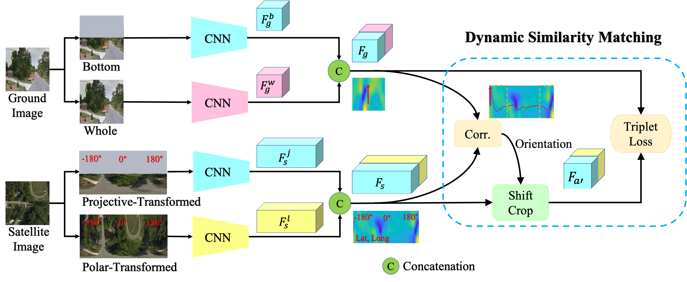

# Accurate 3-DoF Camera Geo-Localization via Ground-to-Satellite Image Matching, TPAMI 2022

This is a journal extension to our conference paper: 

@inproceedings{shi2020looking,

  title={Where am i looking at? joint location and orientation estimation by cross-view matching},
  
  author={Shi, Yujiao and Yu, Xin and Campbell, Dylan and Li, Hongdong},
  
  booktitle={Proceedings of the IEEE/CVF Conference on Computer Vision and Pattern Recognition},
  
  pages={4064--4072},
  
  year={2020}
  
}

Our trained models are available [here](https://anu365-my.sharepoint.com/:f:/g/personal/u6293587_anu_edu_au/Ehl4XLqXmL9Ht8Fe54pGt5ABKvJiLpOcOfSeZbqNF8_khA?e=QbWA5C).
